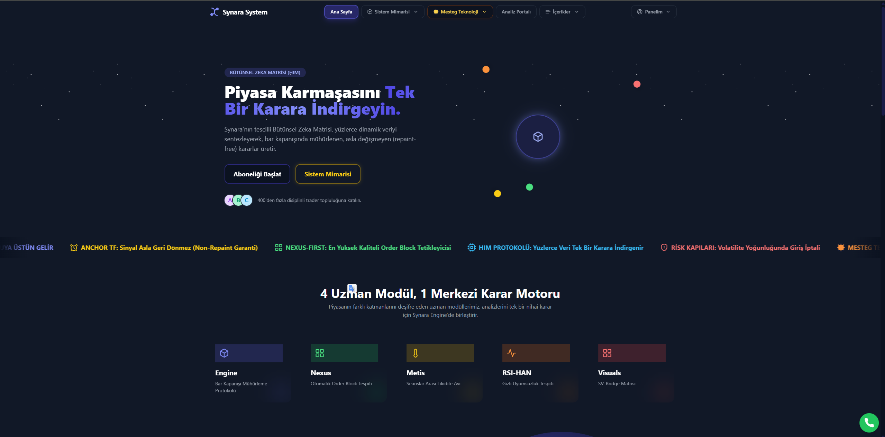
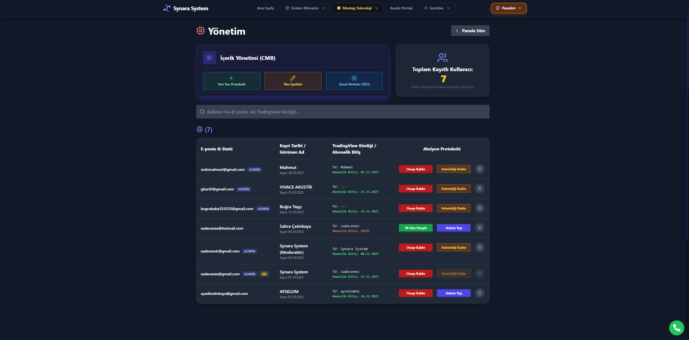
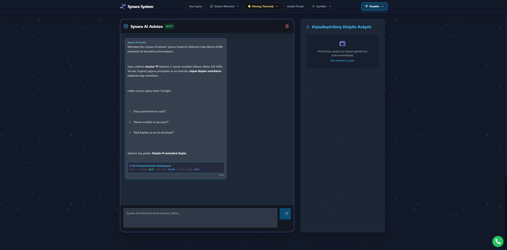
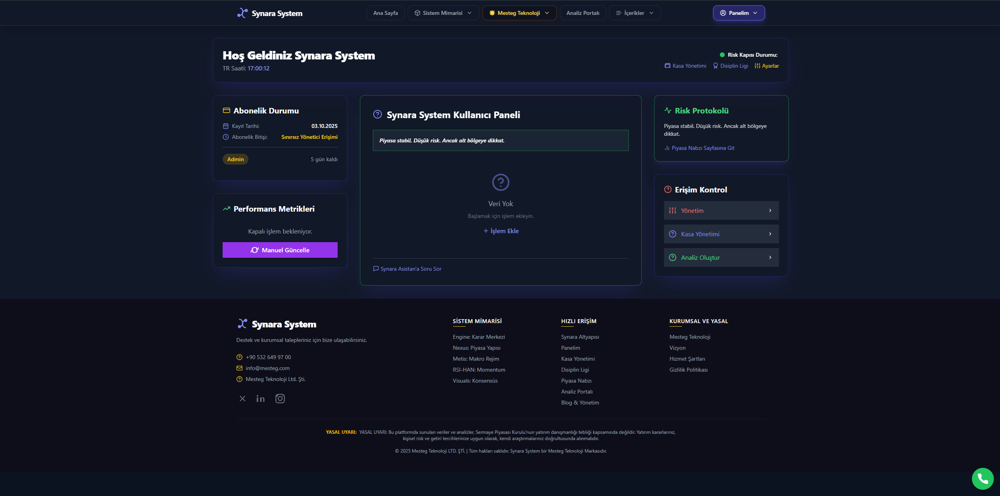

# Synara System v8.1

> AI‑assisted trading & web stack built with Next.js 14, TypeScript, Tailwind, and Firebase. Includes production guardrails (Edge/Node boundaries, env hygiene), admin dashboards, and optional AI agents.

---

## Overview

Synara System is a modular, production‑ready codebase and method for building decision‑support tools and modern web apps. It combines:

* **Trading domain intelligence** (Holistic Intelligence Matrix, Synara IQ‑AI, Trend Atlas, Viper RSI, Strategy modules)
* **Web platform** (App Router, i18n, SEO, Admin & Member areas)
* **AI agents (optional)** for leads, content and support

This repository contains the v8.1 implementation of the web stack and integrations that power Synara.

---

## Features

* **Next.js 14 (App Router)** with strict TypeScript
* **Design system** using Tailwind + Radix UI + CVA + tailwind‑merge
* **Admin & Member areas** (role‑ready)
* **i18n & SEO** (language routing, metadata API, sitemap/robots)
* **Firebase** client + **Firebase Admin** (server‑side only) with session cookies
* **Edge/Node separation** (middleware on Edge; server actions on Node)
* **AI agents (optional)**: Lead, Content, Support — provider‑agnostic
* **Vitest** setup for unit/smoke tests
* **Logging & observability** hooks (token, cost, latency when AI is enabled)

---

## Tech Stack

* **Framework:** Next.js 14, React 18, TypeScript 5
* **Styling:** Tailwind CSS 3, Radix UI, class‑variance‑authority, tailwind‑merge
* **State & Data:** Server Actions, Firestore (optional), cookies
* **Auth:** Firebase Auth (client) + Firebase Admin (server)
* **Testing:** Vitest + jsdom

---

## Modules (Trading domain)

* **Holistic Intelligence Matrix (HIM):** final action suggestion
* **Synara IQ‑AI:** commentary/gauge + RSI strength index
* **Trend Atlas:** structural map (trend channels, S/R, EMAs, Fibs)
* **Viper RSI:** momentum & divergence engine
* **Synara Strategy:** MA/BB crossover & band events

> Note: Some trading modules may live in private repos or TradingView/Pine; this repo focuses on the web/AI integration and UI.

---

## Screenshots





---

## Live

* **Website:** [https://www.synarasystem.com/](https://www.synarasystem.com/)
* **Programming link (portfolio):** [https://github.com/synara-system/Synara-v.8.1](https://github.com/synara-system/Synara-v.8.1)

---

## Quick Start

### Prerequisites

* Node.js ≥ 18
* PNPM or NPM

### Setup

```bash
# 1) Clone
git clone https://github.com/synara-system/Synara-v.8.1.git
cd Synara-v.8.1

# 2) Install deps
pnpm install   # or npm install

# 3) Environment
cp .env.example .env.local
# Fill the variables below

# 4) Run
pnpm dev       # or npm run dev
```

### Environment Variables (reference)

```
# Public Firebase (safe to expose on client)
NEXT_PUBLIC_FIREBASE_API_KEY=
NEXT_PUBLIC_FIREBASE_AUTH_DOMAIN=
NEXT_PUBLIC_FIREBASE_PROJECT_ID=
NEXT_PUBLIC_FIREBASE_STORAGE_BUCKET=
NEXT_PUBLIC_FIREBASE_MESSAGING_SENDER_ID=
NEXT_PUBLIC_FIREBASE_APP_ID=

# Server‑only (DO NOT EXPOSE)
FIREBASE_SERVICE_ACCOUNT_KEY= # JSON string

# Optional market data
FMP_API_KEY=
ALPHA_VANTAGE_API_KEY=

# Optional AI provider
OPENAI_API_KEY=
AI_PROVIDER=openai # openai|anthropic|google|openrouter
AI_MAX_TOKENS=2000
AI_DAILY_COST_CAP_USD=10

# Misc
NEXT_PUBLIC_SITE_URL=https://www.synarasystem.com
```

> Keep **server‑only** variables out of client bundles. Do not import server files from client code.

---

## Scripts

* `dev` – start Next.js dev server
* `build` – production build
* `start` – start production server
* `lint` – run ESLint
* `test` – run Vitest

---

## Project Structure (high‑level)

```
app/
  [lang]/(site)/ ...
  [lang]/(member)/ ...
  admin/
components/
  ui/  # design system atoms
  site/ admin/ auth/
lib/
  auth/ firebase/ i18n/ actions/
  logger.ts schemas.ts utils.ts
middleware.ts
next.config.mjs
```

---

## Security & Quality

* **Edge vs Node:** middleware on Edge only; `firebase-admin` only in Node/server files
* **Env hygiene:** validate `process.env` with a schema (e.g., Zod)
* **Auth:** session cookie `__session`; role/claim checks for admin routes
* **Testing:** unit/smoke tests for critical helpers

---

## Roadmap (short)

* AI Console in Admin (token/cost/latency graphs)
* RAG for Support agent (FAQ + docs)
* i18n SEO (hreflang/canonical, per‑lang OG)

---

## License & Contact

Licensed for evaluation and client work under Mesteg Teknoloji.

**Contact**

* Site: [https://www.synarasystem.com](https://www.synarasystem.com)
* Email: [synarasystem@gmail.com](mailto:synarasystem@gmail.com)

**Topics**: `nextjs`, `typescript`, `tailwind`, `firebase`, `ai`, `trading`
